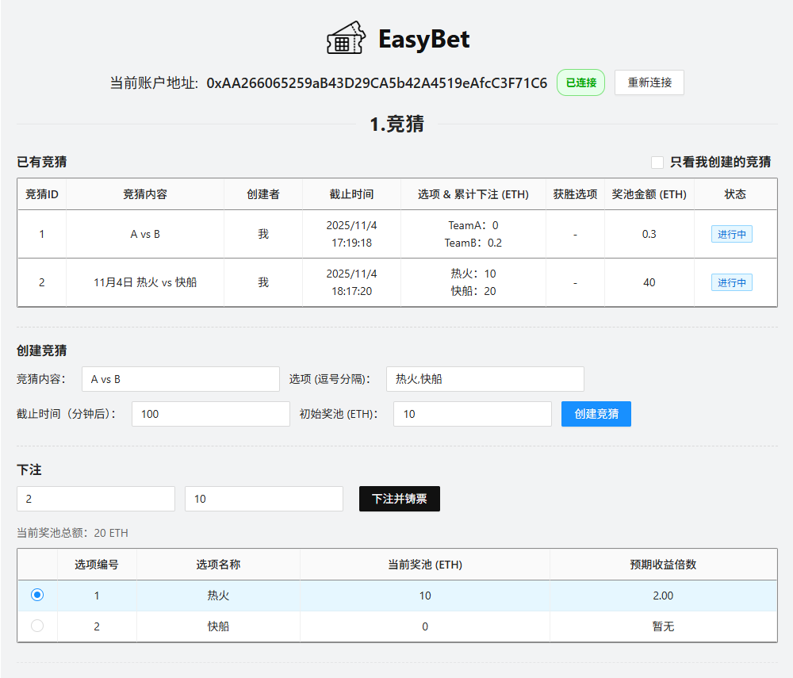
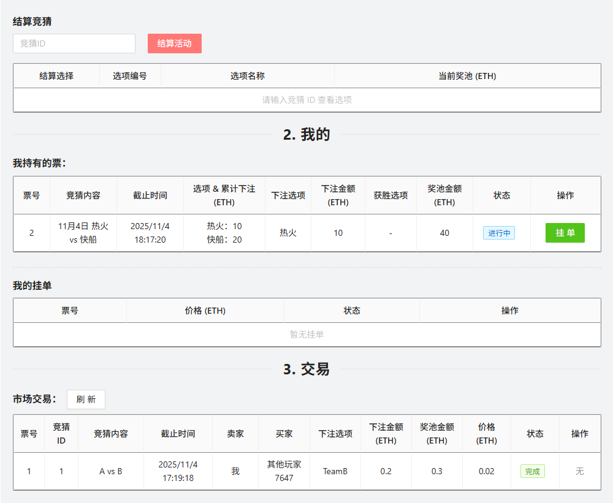
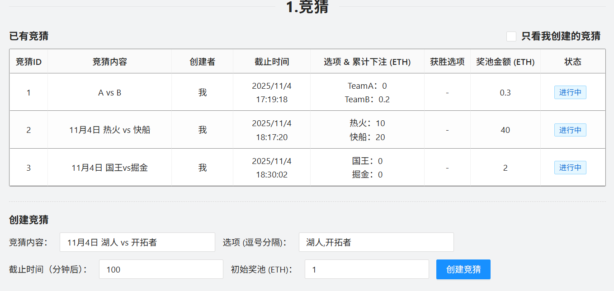
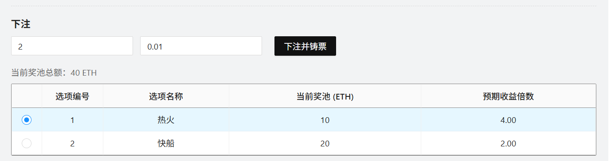
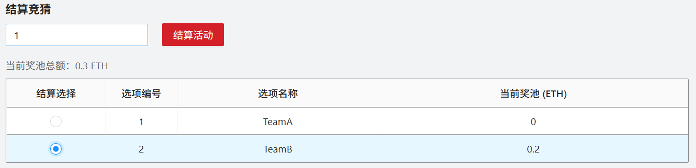
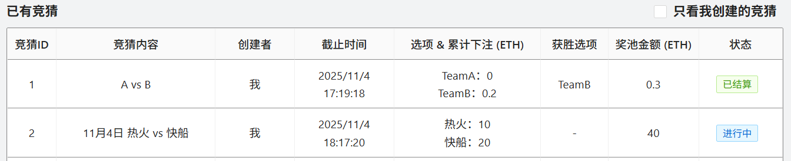
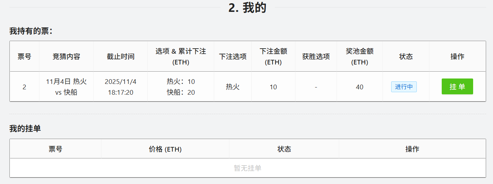
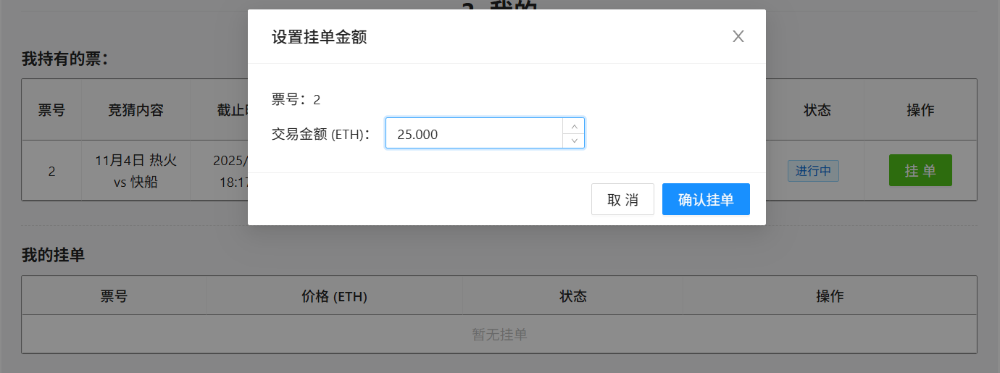
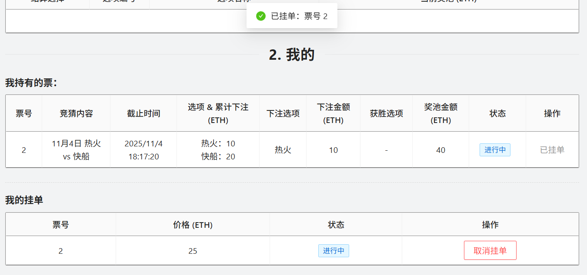
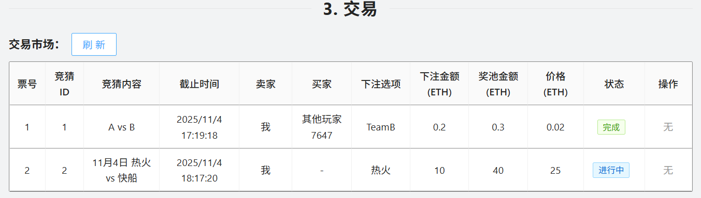

# blockchain

## 如何运行
1. 在本地启动ganache应用。

2. 在 `./contracts` 中安装需要的依赖，运行如下的命令：
    ```bash
    npm install
    ```
3. 在 `./contracts` 中编译合约，运行如下的命令：
    ```bash
    npx hardhat compile
    ```
4. 在 ./contracts 中部署合约，运行如下的命令：
    ```bash
    npx hardhat run scripts/deploy.ts --network ganache
    ```
5. 在 `./frontend` 中安装需要的依赖，运行如下的命令：
    ```bash
    npm install
    ```
6. 在 `./frontend` 中启动前端程序，运行如下的命令：
    ```bash
    npm run start
    ```

## 功能实现分析

- 概览
  - 前端通过浏览器钱包连接本地区块链网络，与合约进行读写交互。
  - 金额在前端以 ETH 展示，发送交易时转换为链上最小单位。
  - 页面分为四个模块：0) 钱包连接，1) 竞猜，2) 我的，3) 交易。

0) 钱包连接
- 在页面顶部提供“连接钱包”入口，支持自动检测与切换到本地网络。
- 显示当前账户地址与连接状态；连接后继续进行后续操作。

1) 竞猜
- 已有竞猜列表
  - 加载所有竞猜并展示创建者、截止时间、选项、各选项累计下注、总奖池、结算状态和胜出选项。
  - 提供筛选，仅查看由当前账户创建的竞猜。
- 创建竞猜
  - 输入竞猜内容、选项、截止时间和初始奖池金额，提交交易在链上创建一条新的竞猜记录。
  - 创建成功后刷新列表。
- 下注并铸票
  - 选择目标竞猜与投注选项，输入投注金额并提交交易，为方便用户投注，计算预期收益倍数。
  - 成功后自动生成代表持仓的票据（NFT），并更新活动和个人持仓数据。
- 结算竞猜
  - 截止后由管理员在前端选择胜出选项并提交交易完成结算。
  - 结算完成后列表与个人持仓都会显示胜出结果与状态。

2) 我的
- 我持有的票
  - 查询当前账户持有的票据，显示票号、竞猜内容、截止时间、各选项累计下注、我的选择与金额、总奖池、结算状态与胜出选项。
  - 对未结算的票据可直接发起挂单。
- 我的挂单
  - 展示当前账户发起的挂单列表（票号、价格、状态）。
  - 对进行中的挂单支持取消操作。

3) 交易
- 市场交易一览
  - 加载全市场的挂牌信息，补充票据对应的竞猜内容、截止时间、票据选择与金额、总奖池等信息，展示价格与交易状态。
  - 非卖家账户可按标价直接购买。
- 挂单
  - 在“我的票”中为指定票据设置价格后上架。
  - 上架前会先完成授权，再提交上架交易；成功后刷新市场与个人列表。

- 其他
  - 支持自动连接与切换本地链网络。
  - 统一处理金额单位转换与错误提示。
  - 使用表格、弹窗与输入组件完成交互与状态反馈。

## 项目运行截图

### 0) 整体UI




### 1) 竞猜
- 竞猜查看与创建

创建竞猜 4 前：

创建竞猜 4 后：


- 下注


- 结算竞猜
结算竞猜 1 前：

结算竞猜 1 后状态刷新：


### 2) 我的
- 查看当前票据与挂单信息


- 挂单


- 挂单成功


### 3) 交易
- 交易市场


具体交易过程需要多用户视角，请看演示视频